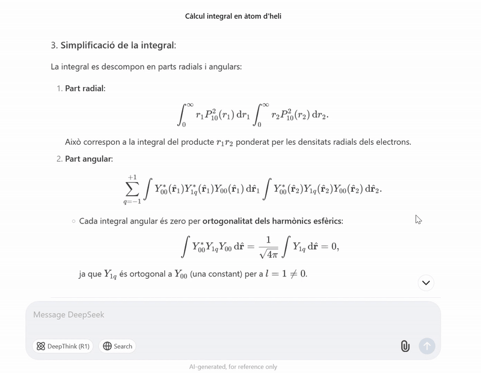
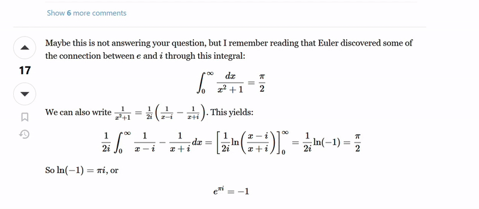

# CopyLaTeX

És una extensió de Firefox que permet copiar ràpidament codi LaTeX (KaTeX o MathJax) d'equacions mostrades a llocs web com ChatGPT, DeepSeek o qualsevol blog que utilitzi equacions. Funciona simplement passant el ratolí per sobre i fent un click per copiar l'expressió LaTeX.

## Com funciona a nivell tècnic

1. **Content Script (`content.js`)**:
   - Detecta automàticament tots els elements `` dins la pàgina.
   - Extreu el codi LaTeX de dins  `<annotation encoding="application/x-tex">`.
   - Mostra un overlay quan es passa el ratolí sobre la fórmula.
   - Permet fer clic per copiar el codi al clipboard mitjançant `navigator.clipboard.writeText()`.
   - Utilitza un `<svg>` inline per no deprendre de fitxers externs

2. **CSS (`overlay.css`)**:
   - Estil del overlay: fons blanc, border i shadow subtil.
   - Text gran i llegible.
   - Centrat sobre la fórmula KaTeX.
   - Cursor `pointer`.

3. **Declaració extensió `manifests.json`**:
   - Demana el permís `clipboardWrite`.
   - Injecte el `content.js` i el `overlay.css`.

## GIFs d'exemple
#### KaTeX

#### MathJax

## Llocs web on és útil
En general a qualsevol blog o web relacionat amb les matemàtiques, la física o l'enginyeria. Alguns exemples típics són:
- KaTeX: ChatGPT, DeepSeek, Notion...
- MathJax: GitHub, Stack Exchange, ProofWiki...

# Relacionat
Queda pendent de fer una versió també per Chrome.