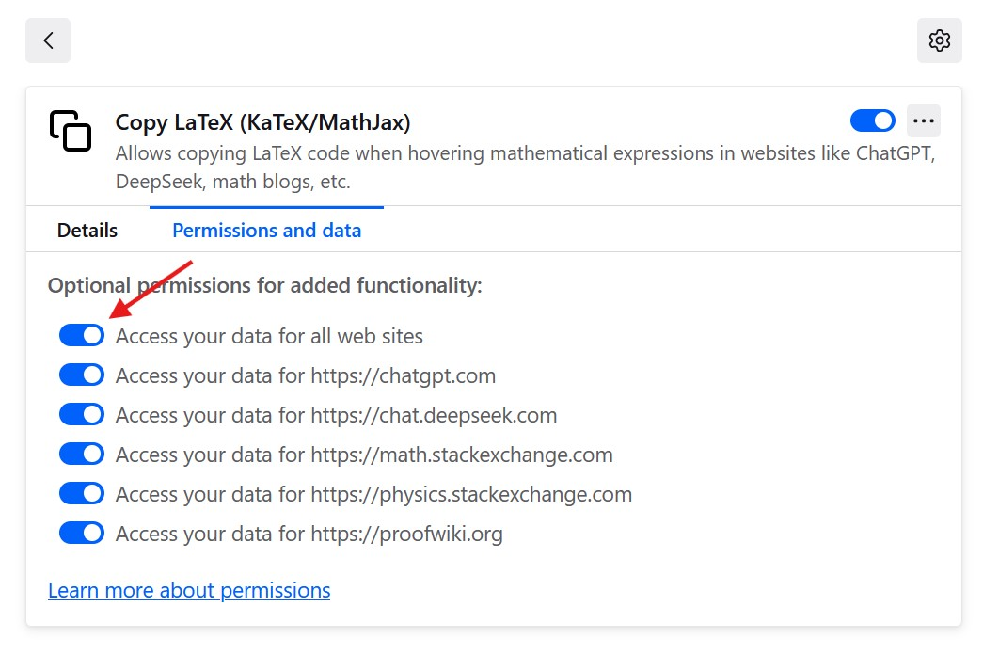
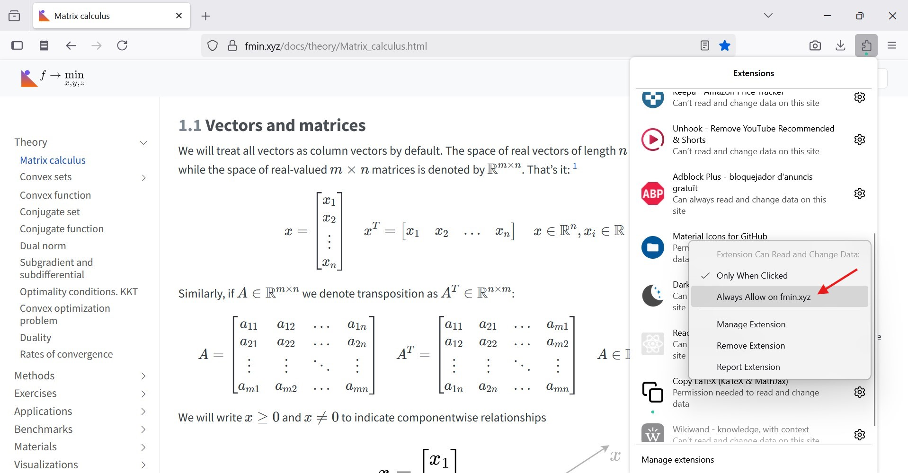

# CopyLaTeX

A Firefox extension that lets you quickly copy LaTeX code (KaTeX or MathJax) from equations displayed on websites like ChatGPT, DeepSeek, or any blog using mathematical equations. It works simply by hovering over an equation and clicking to copy the LaTeX expression.

## How it works technically

1. **Content Script (`content.js`)**:
   - Automatically detects all `` elements on the page.
   - Extracts the LaTeX code from `<annotation encoding="application/x-tex">`.
   - Shows an overlay when hovering over the equation.
   - Allows clicking to copy the code to clipboard using `navigator.clipboard.writeText()`.
   - Uses an inline `<svg>` to avoid external file dependencies.

2. **CSS (`overlay.css`)**:
   - Overlay styling: white background, subtle border and shadow.
   - Large, readable text.
   - Centered over the KaTeX formula.
   - `pointer` cursor.

3. **Extension declaration `manifest.json`**:
   - Injects `content.js` and `overlay.css`.

## Example GIFs
#### KaTeX

#### MathJax

## Popular Sites Using MathJax/KaTeX
Generally any math, physics, or engineering-related blog or website. Some typical examples:
- KaTeX: ChatGPT, DeepSeek, Notion...
- MathJax: Stack Exchange, ProofWiki...

## Host premissions and speed
The javascript source code is extremely simple and available [here](https://github.com/Mapaor/copy-latex-firefox-extension/blob/main/content.js). It loads after everything and is blazingly fast.

However you can always customize in which hosts (websites) the extension loads or not:

This is done in "Firefox Settings > Extensions & Themes" (or simply search `about:addons`), clicking the extension and choosing the tab "Premissions and Data".

In case you turn off the "all sites" toggle option, you can also add manual sites that are not in the default list.

And now the custom site should appear as a new toggle in the "Permissions and data" tab.

## Links
- Firefox Addon page: _Pending_
- GitHub Repo: [https://github.com/Mapaor/copy-latex-firefox-extension](https://github.com/Mapaor/copy-latex-firefox-extension)
- README as a website: [https://mapaor.github.io/copy-latex-firefox-extension/](https://mapaor.github.io/copy-latex-firefox-extension/)

# Related
There is also a Chrome version of this extension: [https://github.com/Mapaor/copy-latex-chrome-extension](https://github.com/Mapaor/copy-latex-chrome-extension) 