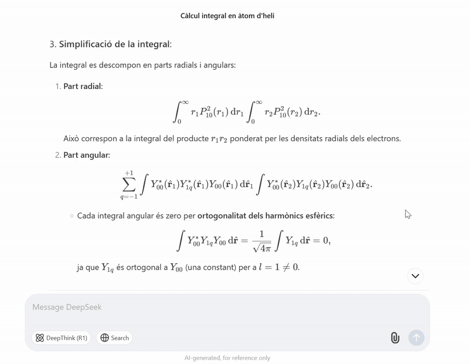
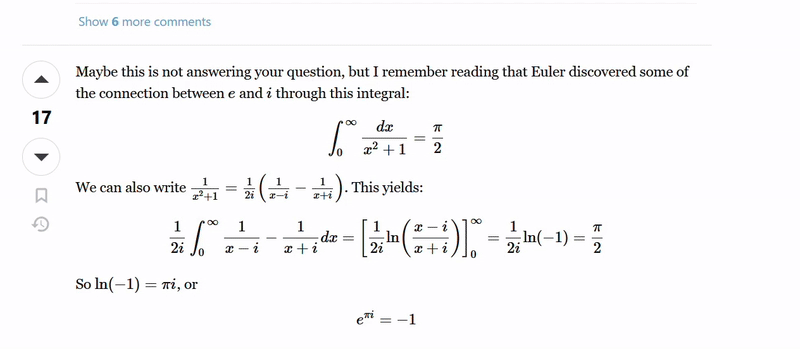
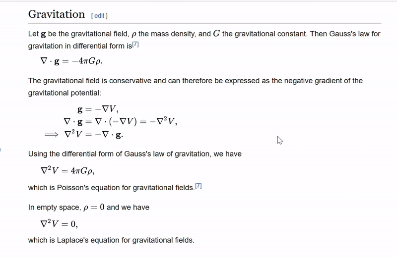
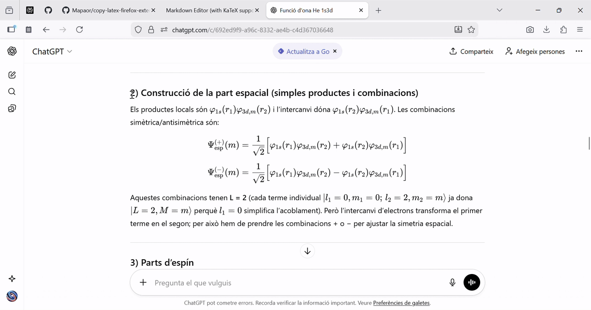
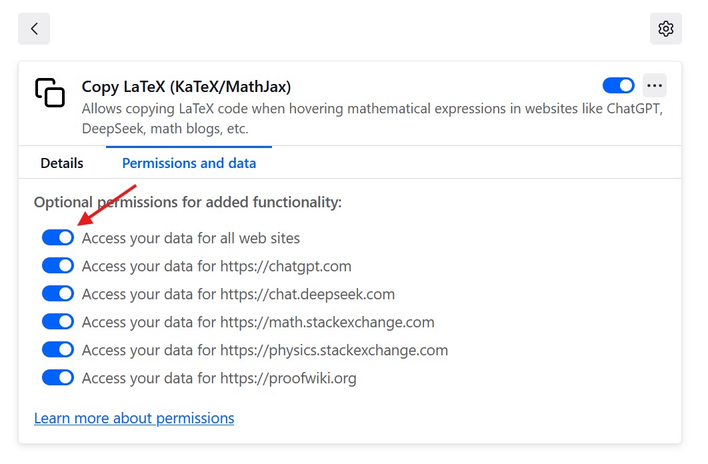
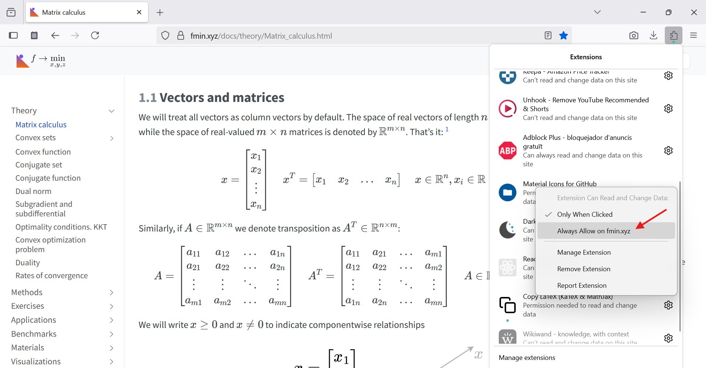

# CopyLaTeX

A Firefox (and [Chrome](#chrome-version)) extension that lets you quickly copy LaTeX code (KaTeX or MathJax) from equations displayed on websites like ChatGPT, DeepSeek, or any blog using mathematical equations. It works simply by hovering over an equation and clicking to copy the LaTeX expression.

Version 1.1: Now it also works with with Wikipedia and Wikiwand images.

Version 1.2: Now it also works for MathJax v3 (when there is no LaTeX code in the HTML) via API.

Version 1.3: Dark mode enabled and replaced check emoji with SVG icon.

Version 1.4: New feature! Select text (that includes formulas), right click on it and a `Copy as Markdown (with LaTeX)` option will appear.

Version 1.5: Now with Typst support!

Version 1.6: A new config button in the popup UI that allows some basic customization (like choosing the theme or hiding the 'copy as' feature in the context menu).

## Example GIFs
#### KaTeX

#### MathJax

#### Wikipedia images

#### Copy as Markdown

You can use [https://markdown-preview-katex.vercel.app/](https://markdown-preview-katex.vercel.app/) to test this feature.

#### Copy as Typst

You can use [https://typst-online.vercel.app/](https://typst-online-editor.vercel.app/) to test this feature.

## Popular Sites Using MathJax/KaTeX
Generally any math, physics, or engineering-related blog or website. Some typical examples:
- KaTeX: ChatGPT, DeepSeek, Notion, Gemini...
- MathJax: Stack Exchange, ProofWiki...

## Host permissions and speed
You can check the javascript source code yourself. It loads after everything and is very fast and small sized. However if you want you can always customize in which hosts (websites) the extension loads or not:

This is done in "Firefox Settings > Extensions & Themes" (or simply search `about:addons`), clicking the extension and choosing the tab "Permissions and Data".

In case you turn off the "all sites" toggle option, you can also add manual sites that are not in the default list.

And now the custom site should appear as a new toggle in the "Permissions and data" tab.

## Technical details

### How to test the extension locally

To check that the extension works you can either:
1. Create a zip that contains all the files inside the `src` directory (without containing the src folder itself).
2. Then go to `about:debugging` (as if it were an URL) and in the 'This Firefox' tab select the button 'Load a Temporary Add-On...' and input the zip file.

Or simply:
- Load the `manifest.json` file directly in `about:debugging` (no zipping needed).

## Links
- Firefox Add-on page: [https://addons.mozilla.org/en-US/firefox/addon/copy-latex](https://addons.mozilla.org/en-US/firefox/addon/copy-latex)
- GitHub Repo: [https://github.com/Mapaor/copy-latex-firefox-extension](https://github.com/Mapaor/copy-latex-firefox-extension)
- README as a website: [https://mapaor.github.io/copy-latex-firefox-extension/](https://mapaor.github.io/copy-latex-firefox-extension/)

## Chrome version
There is also a Chrome version of this extension. Check it out here: [https://github.com/Mapaor/copy-latex-chrome-extension](https://github.com/Mapaor/copy-latex-chrome-extension) 

## Acknowledgements

Credits to @leander-ow for his dark mode contribution and to  @ashigirl96 for suggesting and providing a working code implementation for the copy selection as Markdown feature. 

This extension also works thanks to the following open source projects:
- [Turndown](https://github.com/mixmark-io/turndown) - Library for converting HTML to Markdown
- [tex2typst](https://github.com/qwinsi/tex2typst) - Library for converting LaTeX to Typst
- [markdown2typst](https://github.com/Mapaor/markdown2typst) - Library for converting Markdown to Typst

## License

MIT License.

It is MIT Licensed so that anyone can customize it to their needs but please don't just copy-cat the code and publish it with a new name, it's weird. 

If you have an idea for a new feature open an issue and let me know! Also if you have the time to implement a feature you want it would be great if you made a pull request.

## To-do minor improvements
Some minor things to fix or improve (for when I have the time):
- [ ] In the copy selection (both to Markdown and to Typst) feature fix the Wikipedia case (don't detect images that contain the `mwe-math` related classes as images).
- [ ] Improve the documentation of the extension (the screenshots and GIFs are of previous versions).

## Planned features:
- [X] **Text selection to Markdown**: Select some text that includes equations, right click and a new option "[Extension Icon] Copy as Markdown" appears.
- [X] **Typst support**: 
  Pop up with a toggle between LaTeX and Typst
- [X] **Theme selection**: Config option to choose the theme (light, dark or system)
- [X] **Hide option in context menu**:  Allow users to hide the copy selection feature when right-clicking (for those who don't need it and want a less clustered context menu).
- [ ] **Custom  delimiters**: 
Config option to chose between no delimiters (default), `$` and `$$`, `\(` and `\[`, always `$`, or always `$$`.
- [ ] **Custom translations**. Allow to replace the 'Click to copy', 'Copied!', 'Copy as Markdown' and 'Copy as Typst' messages to be replaced by custom ones.
